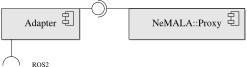

# ros_nemala

A ROS2 adapter for [NEMALA/tools](https://gitlab.com/nemala/tools).



## About

The ros_nemala adapter is a ROS2 node facade for the NeMALA/tools node-manager tool.

The adapter adapts ROS2 messages to NeMALA service topic messages, and sends them to an already running proxy.

## Dependencies

* [ros_nemala_interfaces](https://github.com/MARS-Technion/ros_alate_interfaces)
* [Requirements.txt](Requirements.txt)

## Subscribes to Topics

1. "nemala_input_terminate_dispatcher"

## Parameters

| Parameter                     | Meaning		|Default Value	|	Remark	|
| ---------                     | ------------	| -------		|-------	|
| proxy_endpoint_publishers  | The NeMALA proxy endpoint for publishing. This is the port the publishers write to.  | ipc:///tmp/publishers |  Should match the NeMALA configuration. |
| use_sim_time  	           | Should the time also be simulated	| false	|	See [ROS Clock](http://wiki.ros.org/Clock) |

## Usage

This package was designed to work alongside a NeMALA proxy.

### To run:

Given a running [NeMALA::Proxy](https://gitlab.com/nemala/core/-/blob/master/doc/components.md), make sure to set the *proxy_endpoint_publishers* parameter to the right endpoint.
In the following example, we use a parameter file located in the working directory.

```console
ros2 run ros_nemala node_manager --ros-args --params-file ./node_manager.yaml

```

